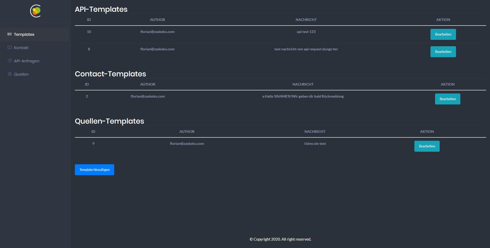
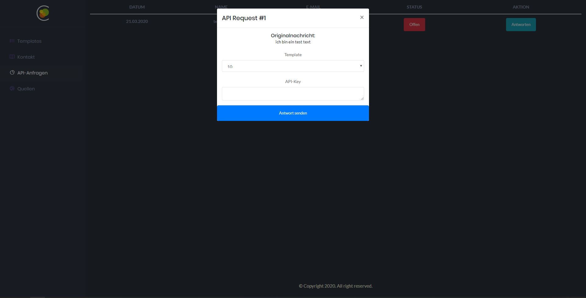

Corona-DataHub WebBackend
-

This backend is for the Frontend in Angular.
You can manage Contact, Sources and API-Requests in a small dashboard. The dashboard comes with a template system for the reponses. You can easily add and edit templates. 

Built With
-
-  [CodeIgniter](https://codeigniter.com/) - The php framework used  
-  MySQL

Placeholder examples
-

- %EMAIL% - Get the email from the sender
- %NAME% - Get the name from the sender
- %TEXT% - Get the text the sender sent
- %DATE% - Get the date when the message was sent
- %APIKEY% - Shows the API-Key which is provided in the form (Only API Requests)

Demo-Images
-

Contributors
-
 - [Florian Z.](https://github.com/Gomze) - @theGomze  
 - [Nils G.](https://github.com/MrCodingMen) - @MrCodingMen  
 - [Julian H.](https://github.com/Newspicel) - @Newspicel  
 - [Lukas R.](https://github.com/DevAvery) - @DevAvery  
 - [Dennis B.](https://github.com/einDeveloper) - @einDeveloper  
 - [Chris S.](https://github.com/c-sakel) - @c-sakel  
 - [Patrick Z.](https://github.com/Paddy00777) - @Paddy00777  
 - [Pascal H.](https://github.com/byPascii) - @byPascii  
